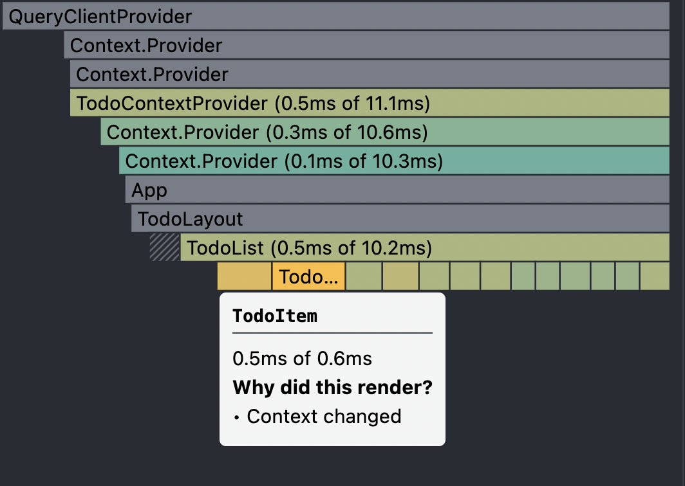
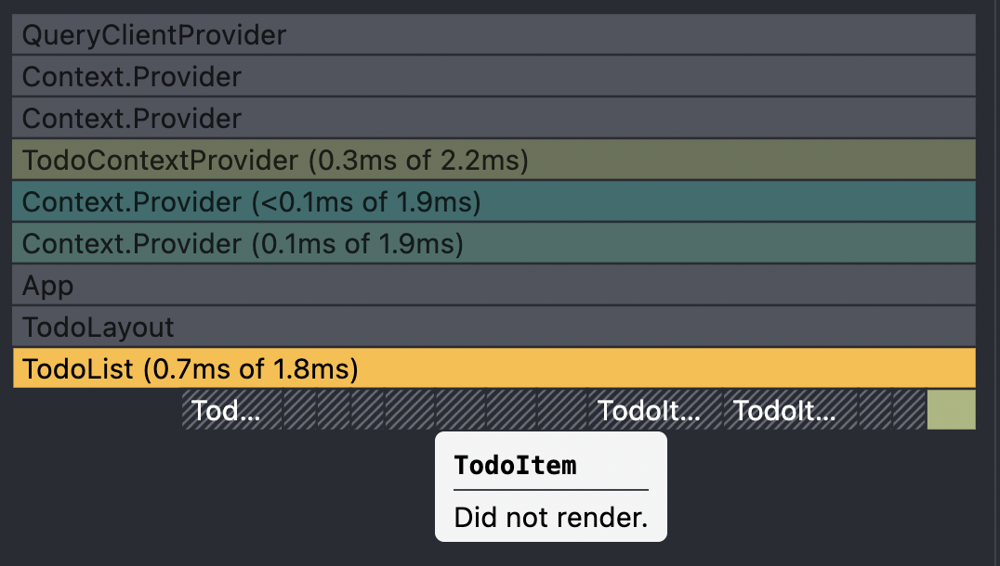

# React Query를 사용해서 Todo앱 만들기

React Query는 실제로 어떻게 사용하는지 익숙해지기 위해 간단한 Todo 앱을 만들어 봤습니다. 현재는 간단한 기능들이 추가가 됐지만 후에 추가해보고 싶은 기능이 있으면 계속 넣을 예정입니다.

<br/>
<br/>
<br/>

## Todo 리스트 불러오기

`db.json`에 저장되어있는 `todos` 데이터를 불러옵니다. 불러오는동안 로딩중임을 알려주는 Spinner를 보여주고 query가 완료되면 todo 리스트가 렌더링 됩니다.

```typescript
// useTodoListQuery.ts

const getTodoList = async () => {
  const response = await axiosInstance.get("todos");
  return response.data;
};

const useTodoListQuery = () => {
  return useQuery<Todo[], AxiosError>(["todoList"], getTodoList);
};
```

```typescript
// TodoList.tsx

const TodoList = () => {
  const { data: todoList, status, error } = useTodoListQuery();

  if (status === "loading") {
    return <Spinner />;
  }

  if (status === "error") {
    return <h1>Error: {error.message}</h1>;
  }

  return <ul className="todo__list">{todoList ? todoList.map((todo) => <TodoItem key={todo.id} {...todo} />) : null}</ul>;
};
```

<br/>
<br/>
<br/>

## Todo 추가하기

입력창에 입력하고 enter를 치거나 +버튼을 누르면 Todo가 추가가 됩니다. `mutation`이 성공하면
todoList 쿼리키를 가진 query를 무효화시키고 refetch한다.

```typescript
// useAddTodoMutation.ts

const useAddTodoMutation = () => {
  const queryClient = useQueryClient();

  const addTodo = async (newTodo: Todo) => {
    const { data } = await axiosInstance.post<Todo>("todos", newTodo);
    return data;
  };

  return useMutation<Todo, AxiosError, Todo>(addTodo, {
    onSuccess: () => {
      queryClient.invalidateQueries("todoList");
    },
    onError: (error) => {
      console.error(error);
      alert("에러가 발생 했습니다. 다시 한번 시도해주세요.");
    },
  });
};
```

```typescript
// TodoInput.tsx

const TodoInput = () => {
  const todoRef = useRef<HTMLInputElement>(null);
  const mutation = useAddTodoMutation();

  const handleSubmit = (e: React.FormEvent) => {
    e.preventDefault();

    if (todoRef.current && todoRef.current.value) {
      mutation.mutate({ title: todoRef.current.value, done: false });
      todoRef.current.value = "";
    }
  };

  return (
    <form onSubmit={handleSubmit} className="todo__search">
      <input type="text" ref={todoRef} className="todo__search--text" placeholder="오늘 할 일" />
      <button className="todo__button">+</button>
    </form>
  );
};
```

<br/>
<br/>
<br/>

## Todo done 처리하기

`checkbox`를 클릭하면 `handleToggleCheckbox` 이벤트 헨들러를 호출해서 todo의 `done`을 업데이트를 시켜주고 있습니다. `update mutation`이 성공하면 api 재요청을 안하고 기존 쿼리에서 return된 data값을 업데이트 시켜줬습니다.

```typescript
// TodoItem.tsx

const handleToggleCheckbox = () => {
  updateMutation.mutate({ ...todo, done: !todo.done });
};
```

```typescript
// useUpdateTodoMutation.ts

const updateTodo = async (newTodo: Todo) => {
  const { data } = await axiosInstance.patch(`/todos/${newTodo.id}`, newTodo);
  return data;
};

const useUpdateTodoMutation = () => {
  const queryClient = useQueryClient();

  return useMutation(updateTodo, {
    onSuccess: (newData) => {
      queryClient.setQueryData<Todo[]>("todoList", (oldData) => {
        if (!oldData) return [];
        return oldData.map((data) => (data.id === newData.id ? newData : data));
      });
    },
    onError: (error) => {
      console.error(error);
      alert("에러가 발생 했습니다. 다시 한번 시도해주세요.");
    },
  });
};
```

<br/>
<br/>
<br/>

## Todo에 수정 버튼 누르기

`수정` 버튼을 누르면 수정하는 modal창이 뜨고, `todoActionsContext`의 `toggleEditModal` 함수를 호출해서 modal창이 뜨고, `getTodo` 함수를 호출하여 `todoContext`의 `todo` state에 선택된 todo로 setState를 해줍니다.

```typescript
// TodoList.tsx

const handleClickUpdate = () => {
  todoActionsContext.toggleEditModal(true);
  todoActionsContext.getTodo(todo);
};
```

<br/>
<br/>
<br/>

## 수정 완료하기

모달의 `수정` 버튼을 누르면 updateMutation의 `mutate` 함수를 호출하여 업데이트된 값을 쿼리에 업데이트 합니다. 업데이트가 성공하면 `todoActionsContext`의 `toggleEditModal` 함수를 호출해서 모달창을 닫습니다.

```typescript
// TodoEditModal.tsx

const handleClickUpdate = () => {
  if (inputEl.current) {
    updateTodoMutation.mutate(
      { ...todoContext.todo, title: inputEl.current.value },
      {
        onSuccess: () => {
          todoActionsContext.toggleEditModal(false);
        },
      }
    );
  }
};
```

<br/>
<br/>
<br/>

## Todo 삭제하기

deleteMutation의 `mutate`함수를 호출하여 해당 data를 삭제를 요청합니다. mutation이 성공하면 네트워크 재호출 없이 기존 data에서 해당 todo를 삭제시킵니다.

```typescript
// TodoItem.tsx

const handleClickDelete = () => {
  if (todo.id) deleteMutation.mutate(todo.id);
};
```

```typescript
// useDeleteTodoMutation.ts

const useDeleteTodoMutation = () => {
  const queryClient = useQueryClient();

  const deleteTodo = async (todoId: number) => {
    await axiosInstance.delete(`/todos/${todoId}`);
    return todoId;
  };

  return useMutation(deleteTodo, {
    onSuccess: (deleteTodoId) => {
      queryClient.setQueryData<Todo[]>("todoList", (oldData) => {
        if (!oldData) return [];

        return oldData?.filter((data) => data.id !== deleteTodoId);
      });
    },
    onError: (error) => {
      console.error(error);
      alert("에러가 발생 했습니다. 다시 한번 시도해주세요.");
    },
  });
};
```

<br/>
<br/>
<br/>

## 성능 개선

React 프로파일링으로 성능 테스트를 해보았고 거기서 문제점을 발견을 했습니다. **수정 버튼을 눌렀을때 모든 컴포넌트가 리렌더링을 하고 있었습니다.** 모달 하나 띄우는건데 모든 컴포넌트가 리렌더링 되는건 분명 비효율적이라고 느껴졌습니다. 이러한 문제가 발생한 원인을 분석한 결과 다음과 같은 문제점을 발견했습니다.

### state가 변경되면 action Context만 subscribe 하고있는 컴포넌트에서도 리렌더링이 발생하고 있었습니다.

`action context`만 subscribe하고 싶은 컴포넌트에서 비효율적인 리렌더링을 막기위해서 `state context`와 `actions context`를 분리를 시켰습니다. 테스트 결과, actions context만 subscribe하고 있는 컴포넌트에서도 리렌더링이 발생하고 있었습니다.

<br/>



<br>

각각의 함수에 useCallback을 사용해 TodoActionsContext Provider에 전달했었지만 제가 원하는 방향으로 동작을 안했습니다. 그 이유는 각각의 함수에는 memorized 되었지만 막상 전달하고있는 `value props`인 `{getTodo, toggleEditModal}` 객체는 memorized 된 상태가 아니었습니다.

```typescript
const TodoContextProvider = ({ children }: TodoContextProviderProps) => {
  const [todo, setTodo] = useState<Todo>({
    title: "",
    done: false,
  });
  const [editModal, setEditModal] = useState(false);

  const getTodo = useCallback((todo: Todo) => {
    setTodo(todo);
  }, []);

  const toggleEditModal = useCallback((active: boolean) => {
    setEditModal(active);
  }, []);

  return (
    // value props인 {getTodo, toggleEditModal}은 memorized가 안된 상태입니다.
    <TodoActionsContext.Provider value={{getTodo, toggleEditModal}}>
      <TodoContext.Provider value={{ todo, editModal }}>{children}</TodoContext.Provider>
    </TodoActionsContext.Provider>
  );
```

<br />
<br />

그래서 actions 객체에 필요한 메서드를 넣은 다음 useMemo를 사용해 memorizing을 했더니 원하는대로 동작이 됐습니다.

```typescript
// TodoContext.ts

const TodoContextProvider = ({ children }: TodoContextProviderProps) => {
  const [todo, setTodo] = useState<Todo>({
    title: "",
    done: false,
  });
  const [editModal, setEditModal] = useState(false);

  // actions 객체 안에 메서드를 넣어서 관리를 했습니다.
  const actions = useMemo(
    () => ({
      getTodo(todo: Todo) {
        setTodo(todo);
      },
      toggleEditModal(active: boolean) {
        setEditModal(active);
      },
    }),
    []
  );

  return (
    // 드디어 value props에 메모라이징된 값이 들어갔습니다!
    <TodoActionsContext.Provider value={actions}>
      <TodoContext.Provider value={{ todo, editModal }}>{children}</TodoContext.Provider>
    </TodoActionsContext.Provider>
  );
};
```



<br/>
<br/>
<br/>

## 고민해야할 부분

## 유저가 실수로 삭제 버튼 눌렀을 때

유저가 실수로 삭제 버튼을 눌렀을 때, 바로 삭제되면 당황스럽고 다시 등록해야하는 귀찮은 작업을 해야할 것입니다. 심지어삭제된 todo의 내용이 좀 길었다면 까먹어서 다시 등록하기도 힘들 수도 있다고 생각합니다.

<br/>

## 등록된 Todo가 너무 많을때

등록된 todo가 너무 많으면 현재 만들어진 기능만 보면 특정한 todo를 찾기가 너무 번거로워 보입니다. 이를 해결하기위해 `sort 기능`, `검색 기능` 등을 추가해야할거 같습니다.

<br/>
<br/>
<br/>

## 소스 코드

https://github.com/HyeBinYang/todo_by_react-query
